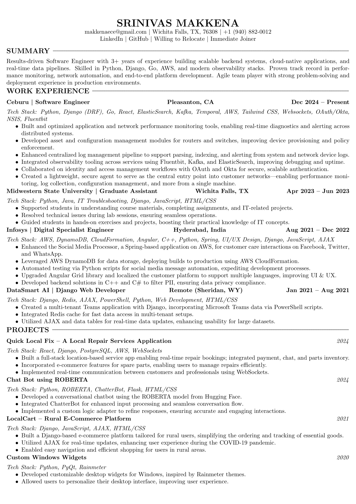

<!--# Srinivas Makkena--> 
<!--## Animated Badge--> 

  
  
    

  

  

  <!-- Email Logo -->
  
  <!-- LinkedIn Logo -->
  
  <!-- GitHub Logo -->
  

## 📄 Resume

  
📎 Click to Preview & Download My Resume

   

  

    
    
  

  

    
  

---

---
## About Me

I am a <strong>Computer Science Master's graduate</strong> from <strong>Midwestern State University</strong>, with a strong passion for developing scalable and reliable software solutions. My expertise includes a broad range of technologies such as <strong>Python</strong>, <strong>Java</strong>, <strong>Django</strong>, <strong>Angular</strong>, <strong>AWS</strong>, and <strong>Git</strong>. I am experienced in both <strong>front-end</strong> and <strong>back-end development</strong>, and I am particularly drawn to working with <strong>cloud technologies</strong>, especially <strong>AWS</strong>.

I am also deeply interested in <strong>AI</strong>, <strong>Machine Learning</strong>, and <strong>Web Development</strong>, constantly exploring new ways to apply these technologies in real-world applications. Known for my <strong>problem-solving abilities</strong> and <strong>adaptability</strong> to emerging technologies, I consistently deliver <strong>high-quality results</strong> in <strong>fast-paced, agile environments</strong>.

---

## Technical Skills

Here are some of my key technical skills:

<ul>
    <li>
      
      
      
      
      
    </li>
    <li>
      
      
      
    </li>
    <li>
      
      
      
      
      
    </li>
    <li>
      
      
    </li>
    <li>
      
      
      
    </li>
</ul>

---

## My GitHub Stats

  
  
  

---

## 🤝 Let’s Connect

  
  
  

---

#### *Thanks for visiting my profile!*
